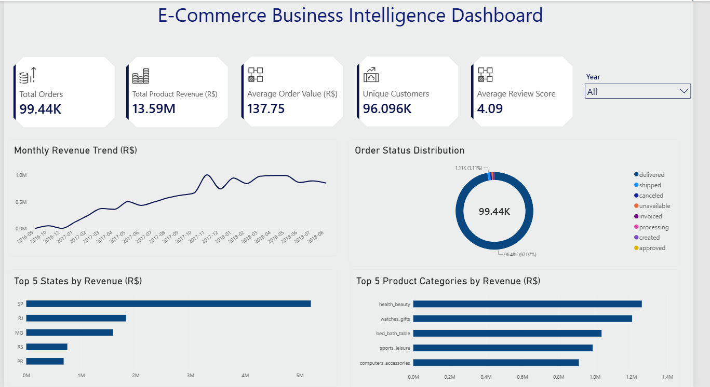
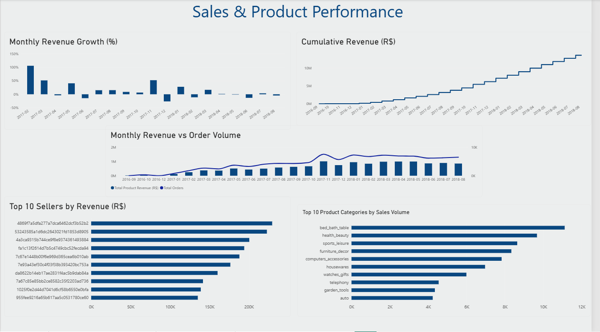
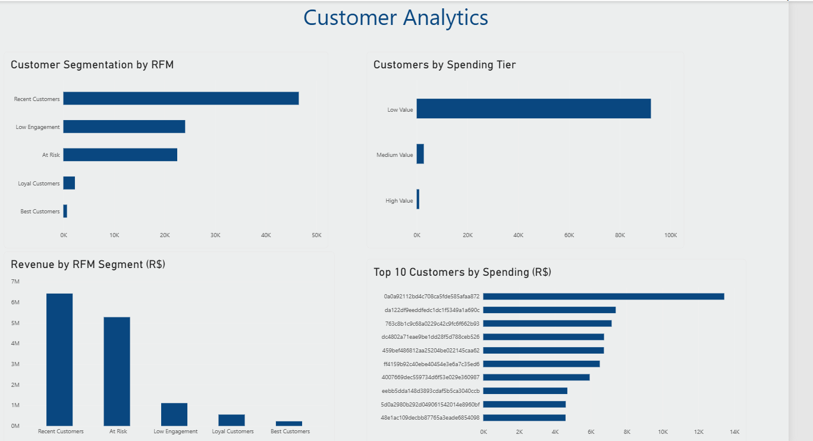
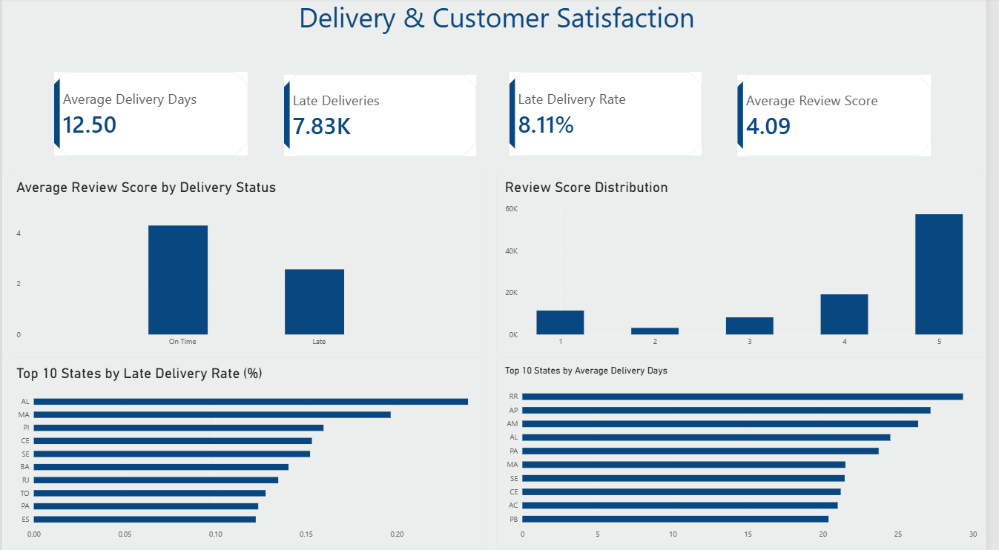

# E-Commerce Business Intelligence & Customer Analytics

## Project Overview

This project analyzes the Brazilian E-Commerce Public Dataset by Olist using **SQL and Power BI**.

The objective was to transform raw e-commerce data into actionable business insights across sales, customers, products, sellers, payments, delivery performance, and customer satisfaction.

The project combines SQL-based data validation and business analysis with an interactive Power BI dashboard for decision-making.

## Tools Used

- MySQL
- SQL
- Power BI
- DAX
- MySQL Workbench
- GitHub

## Dataset

The dataset contains approximately **100,000 orders** from the Brazilian e-commerce marketplace Olist.

The analysis uses data covering:

- Customers
- Orders
- Order items
- Products
- Sellers
- Payments
- Reviews
- Product categories
- Geographic information

## SQL Analysis

SQL was used for data validation, exploration, KPI calculation, and advanced business analysis.

Key SQL techniques demonstrated include:

- Multi-table JOINs
- Common Table Expressions (CTEs)
- Subqueries
- Aggregate functions
- CASE statements
- Window functions
- RANK()
- LAG()
- Running totals
- Moving averages
- Customer segmentation
- RFM analysis

The complete SQL analysis is available here:

[View SQL Analysis](olist_ecommerce_analysis.sql)

## Key Business KPIs

| KPI | Result |
|---|---:|
| Total Orders | 99,441 |
| Product Revenue | R$13.59M |
| Average Order Value | R$137.75 |
| Unique Customers | 96,096 |
| Repeat Customer Rate | 3.12% |
| Average Delivery Time | 12.50 days |
| Late Delivery Rate | 8.11% |
| Average Review Score | 4.09 |

## Key Insights

### Sales Performance

Revenue grew significantly throughout 2017 and remained strong during most of 2018.

November 2017 was a particularly strong month, generating more than **R$1 million in product revenue**.

São Paulo (SP) was the largest market, generating approximately **R$5.20 million** in product revenue.

### Product Performance

The highest-revenue product categories included:

- Health & Beauty
- Watches & Gifts
- Bed, Bath & Table
- Sports & Leisure
- Computers & Accessories

Health & Beauty generated approximately **R$1.26 million**, making it the leading category by product revenue.

### Customer Analysis

The business served **96,096 unique customers**, but only approximately **3.12% were repeat customers**, indicating a major customer-retention opportunity.

RFM segmentation identified an **At Risk** customer segment representing approximately **R$5.31 million in historical revenue**.

This suggests that re-engaging valuable inactive customers could represent an important growth opportunity.

### Delivery & Customer Satisfaction

Average delivery time was approximately **12.5 days**, with **8.11% of deliveries arriving late**.

On-time deliveries received an average review score of approximately **4.29**, compared with **2.57 for late deliveries**.

This shows a strong association between delivery performance and customer satisfaction.

### Payment Behavior

Credit cards were the dominant payment method, accounting for the majority of payment transactions.

Installment payments were also widely used, highlighting the importance of flexible payment options in the marketplace.

## Business Recommendations

Based on the analysis:

1. Develop retention campaigns targeting repeat purchases, since the repeat customer rate is relatively low.

2. Prioritize re-engagement campaigns for high-value customers classified as **At Risk** through RFM segmentation.

3. Investigate states and logistics routes with high late-delivery rates to improve customer satisfaction.

4. Maintain strong inventory and marketing support for leading categories such as Health & Beauty and Watches & Gifts.

5. Continue supporting flexible credit-card installment options due to their importance in customer payment behavior.

## Power BI Dashboard

The Power BI report contains four analytical pages.

### Executive Overview

Provides a high-level view of revenue, orders, customers, review scores, geographic performance, product categories, and order status.



### Sales & Product Performance

Analyzes monthly revenue growth, cumulative revenue, order volume, product categories, and seller performance.



### Customer Analytics

Analyzes customer spending, RFM segmentation, spending tiers, and highest-value customers.



### Delivery & Customer Satisfaction

Analyzes delivery speed, late deliveries, review scores, and geographic delivery performance.



## Project Structure

```text
olist-ecommerce-business-intelligence/
│
├── olist_ecommerce_analysis.sql
├── Executive_Overview.png
├── Sales_product_performance.png
├── Customer_analytics.png
├── Delivery_customer_satisfaction.png
└── README.md
```

## Conclusion

This project demonstrates an end-to-end business intelligence workflow, from validating and analyzing relational e-commerce data with SQL to developing interactive Power BI dashboards.

The analysis highlights opportunities around **customer retention, high-value customer re-engagement, delivery performance, product strategy, and geographic sales performance**.
